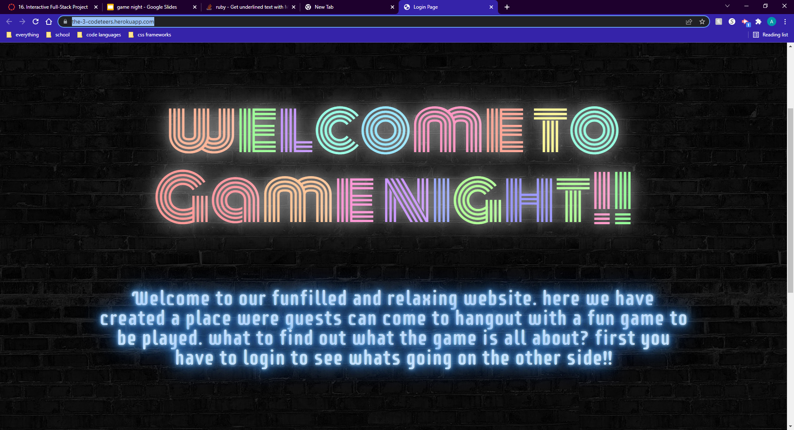

# the-3-codeteers

## Project Requirements
>>Use Node.js and Express.js to create a RESTful API.
>
>>Use Handlebars.js as the templating engine.
>
>>Use MySQL and the Sequelize ORM for the database.
>
>>Have both GET and POST routes for retrieving and adding new data.
>
>>Be deployed using Heroku (with data).
>
>>Use at least one new library, package, or technology that we haven’t discussed.
>
>>Have a polished UI.
>
>>Be responsive.
>
>>Be interactive (i.e., accept and respond to user input).
>
>>Have a folder structure that meets the MVC paradigm.
>
>>Include authentication (express-session and cookies).
>
>>Protect API keys and sensitive information with environment variables.
>
>>Have a clean repository that meets quality coding standards (file structure, naming conventions, follows best practices for class/id naming conventions, indentation, quality comments, etc.).
>
>>Have a quality README (with unique name, description, technologies used, screenshot, and link to deployed application).

## Description

> Game Night
>>This app is to have a chill game night with friends, family and other people just like you!!

## technologies Used

Html, Css, Javascript, Node, Express, MySql, Sequelize, Heroku, Howler.js
### tasks and roles
>Mark 
>>express, handlebars, javaScript, routes, MySQL
>
>Joseph 
>>howler, javascript, server, html, css, made games
>
>Andrew
>>html, css, javaScript, slideshow 

## links
Github issues: https://github.com/afebre1027/the-3-codeteers

Heroku: https://the-3-codeteers.herokuapp.com/

